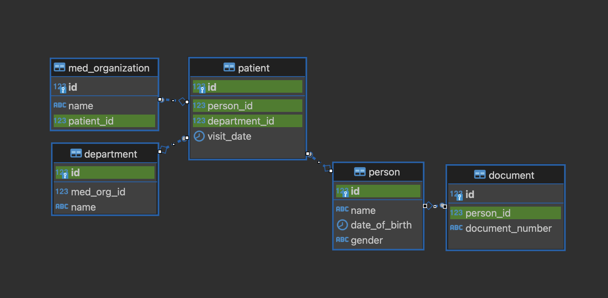

## SQL задача

**Схема**



<details>
<summary>Данные для создания и заполнения БД</summary>

```sql

CREATE TABLE person (
    id BIGINT PRIMARY KEY,
    name VARCHAR(255),
    date_of_birth DATE,
    gender VARCHAR(10)
);

CREATE TABLE document (
    id BIGINT PRIMARY KEY,
    person_id BIGINT,
    document_number VARCHAR(255),
    FOREIGN KEY (person_id) REFERENCES person(id)
);


CREATE TABLE department (
    id BIGINT PRIMARY KEY,
    med_org_id BIGINT,
    name VARCHAR(255)
);

CREATE TABLE patient (
    id BIGINT PRIMARY KEY,
    person_id BIGINT,
    department_id BIGINT,
    visit_date DATE,
    FOREIGN KEY (person_id) REFERENCES person(id),
    FOREIGN KEY (department_id) REFERENCES department(id)
);

CREATE TABLE med_organization (
    id BIGINT PRIMARY KEY,
    name VARCHAR(255),
    patient_id BIGINT,
    FOREIGN KEY (patient_id) REFERENCES patient(id)
);

-- Вставляем данные в таблицу person
INSERT INTO person (id, name, date_of_birth, gender) VALUES
(1, 'Иван Иванов', '1980-05-15', 'Male'),
(2, 'Мария Смирнова', '1990-12-28', 'Female'),
(3, 'Алексей Петров', '1975-07-10', 'Male'),
(4, 'Елена Козлова', '1988-09-20', 'Female'),
(5, 'Сергей Васильев', '1982-03-25', 'Male'),
(6, 'Ольга Никитина', '1995-11-12', 'Female'),
(7, 'Павел Морозов', '1987-08-18', 'Male'),
(8, 'Екатерина Иванова', '1993-04-30', 'Female'),
(9, 'Николай Соколов', '1984-06-08', 'Male'),
(10, 'Татьяна Петрова', '1991-02-14', 'Female');

-- Вставляем данные в таблицу document
INSERT INTO document (id, person_id, document_number) VALUES
(1, 1, '1234567890'),   -- Иван Иванов
(2, 2, '9876543210'),   -- Мария Смирнова
(3, 3, '5555555555'),   -- Алексей Петров
(4, 4, '1111222233'),   -- Елена Козлова
(5, 5, '4444333322'),   -- Сергей Васильев
(6, 6, '7777888899'),   -- Ольга Никитина
(7, 7, '6666555544'),   -- Павел Морозов
(8, 8, '9999888877'),   -- Екатерина Иванова
(9, 9, '3333444455'),   -- Николай Соколов
(10, 10, '2222111100'); -- Татьяна Петрова

-- Вставляем данные в таблицу department
INSERT INTO department (id, med_org_id, name) VALUES
(1, 1, 'Кардиология'),
(2, 1, 'Неврология'),
(3, 2, 'Педиатрия'),
(4, 2, 'Ортопедия'),
(5, 3, 'Терапия'),
(6, 3, 'Хирургия');

-- Вставляем данные в таблицу patient
INSERT INTO patient (id, person_id, department_id, visit_date) VALUES
(1, 1, 1, '2023-01-10'),   -- Иван Иванов //посетил кардиологию
(2, 1, 2, '2023-02-20'),   -- Иван Иванов //посетил неврологию
(3, 2, 3, '2023-03-15'),   -- Мария Смирнова //посетила педиатрию
(4, 3, 4, '2023-04-25'),   -- Алексей Петров //посетил ортопедию
(5, 4, 5, '2023-05-10'),   -- Елена Козлова //посетила терапию
(6, 5, 6, '2023-06-20'),   -- Сергей Васильев //посетил хирургию
(7, 6, 1, '2023-07-15'),   -- Ольга Никитина //посетила кардиологию
(8, 7, 2, '2023-08-30'),   -- Павел Морозов //посетил неврологию
(9, 8, 3, '2023-09-05'),   -- Екатерина Иванова //посетила педиатрию
(10, 9, 4,'2023-10-12');   -- Николай Соколов //посетил ортопедию

-- Вставляем данные в таблицу med_organization
INSERT INTO med_organization (id, name, patient_id) VALUES
(1, 'Городская больница №1', 1),   -- Иван Иванов
(2, 'Городская больница №1', 2),   -- Мария Смирнова
(3, 'Городская больница №1', 3),   -- Алексей Петров
(4, 'Городская больница №1', 4),   -- Елена Козлова
(5, 'Городская больница №1', 5),   -- Сергей Васильев
(6, 'Городская больница №1', 6),   -- Ольга Никитина
(7, 'Городская больница №1', 7),   -- Павел Морозов
(8, 'Городская больница №1', 8),   -- Екатерина Иванова
(9, 'Городская больница №1', 9);   -- Николай Соколов
  			           -- Татьяна Петрова //не посещала


````

</details>

**Задание_1**
Необходимо написать SQL-запрос для получения списка людей (таблица person),
которые посещали отделение "Неврология" (таблица department).
Результаты должны быть отсортированы по дате рождения в порядке убывания.

<details>
<summary>Решение</summary>

```sql
SELECT p.*
FROM person p 
LEFT JOIN patient pt ON pt.person_id = p.id
LEFT JOIN department dp on dp.id = pt.department_id
WHERE dp.name = 'Неврология'
ORDER by p.date_of_birth DESC;
```
</details>

**Задание_2**
Определить по номеру документа, является ли данная персона нашим пациентом?   
Нам известен номер документа и id медицинской организации.  
Пациент — это персона, посетившая медицинскую организацию.

<details>
<summary>Решение</summary>

<b>Вложенные запросы</b>

```sql
SELECT EXISTS (
    SELECT 1 
    FROM person p
    WHERE p.id IN (
        SELECT d.person_id
        FROM document d
        WHERE d.document_number = '1234567890'
    )
    AND p.id IN (
        SELECT pt.person_id
        FROM patient pt
        WHERE pt.id IN (
            SELECT mo.patient_id
            FROM med_organization mo
            WHERE mo.name = 'Городская больница №1'
        )
    )
);
````
<b>Через Join </b>
```postgres-sql
SELECT COUNT(p.id) > 0 AS is_patient 
FROM person p 
LEFT JOIN document d ON d.person_id = p.id 
LEFT JOIN patient pt ON pt.person_id = p.id
LEFT JOIN med_organization mo ON mo.patient_id = pt.id 
where d.document_number ='1234567890' AND mo.name = 'Городская больница №1';

SELECT EXISTS (
    SELECT 1 
    FROM (
        SELECT p.id
        FROM person p
        LEFT JOIN "document" d ON d.person_id = p.id
        LEFT JOIN patient pt ON pt.person_id = p.id
        LEFT JOIN med_organization mo ON mo.patient_id = pt.id
        WHERE d.document_number ='1234567890' AND mo.name = 'Городская больница №1'
    ) AS subquery
);
```
</details>


